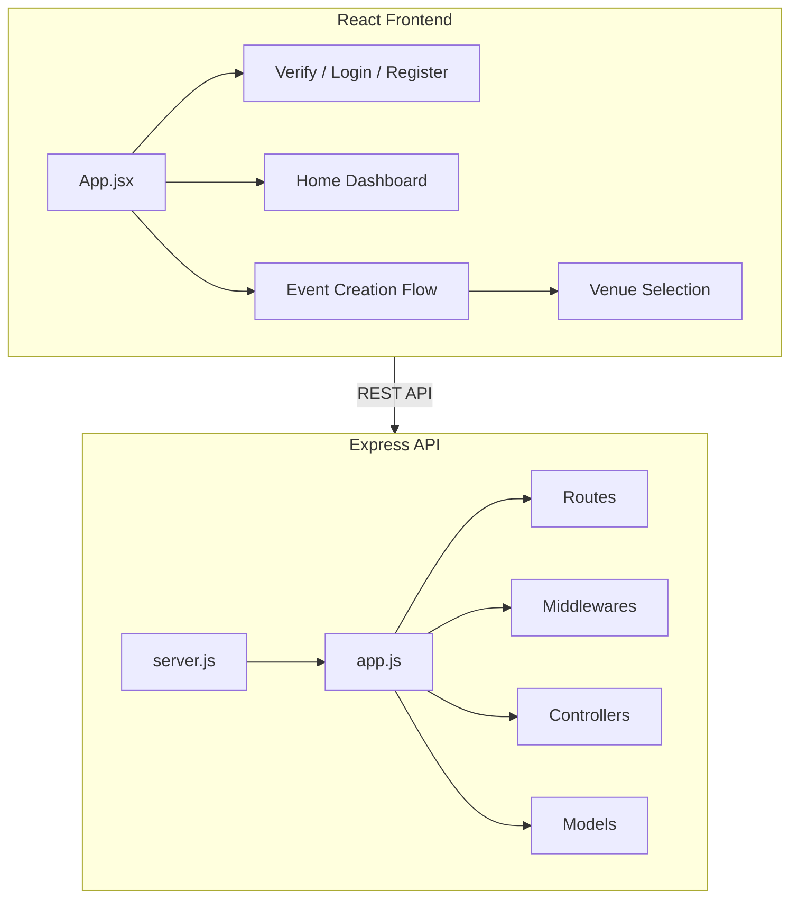

# Hoop Project Overview and Developer Guide

This document provides a summary of **Hoop**, an event planner guide application designed to streamline event planning for non-professional organizers.

---

## 🏗️ Architecture & Stack

The codebase is organized into a modular monorepo structure consisting of a backend API and a frontend application.

### 💻 Frontend
- **Framework:** React 18 (Vite-based build tool)
- **Styling:** CSS-in-JS design constants & custom styles matching a custom Design System.
- **Routing:** React Router DOM (v6)
- **Key Modules:**
  - **Verification/Auth:** LogIn, Register, and Account Verification under [verify/](file:///Users/leaphourleu/Storage/Y2SE/T3/T3%20Project%20/T3-Project/Frontend/HOOP-app/src/components/verify).
  - **Homepage/Dashboard:** Navbar, Hero section, and footer elements under [Homepage/](file:///Users/leaphourleu/Storage/Y2SE/T3/T3%20Project%20/T3-Project/Frontend/HOOP-app/src/components/Homepage).
  - **Event Creation Flow:** Curated event configuration workflow starting with [Venue Selection](file:///Users/leaphourleu/Storage/Y2SE/T3/T3%20Project%20/T3-Project/Frontend/HOOP-app/src/components/EventCreation/VenueSelection.jsx).

### ⚙️ Backend
- **Runtime:** Node.js
- **Framework:** Express.js
- **Key Files & Folders:**
  - [server.js](file:///Users/leaphourleu/Storage/Y2SE/T3/T3%20Project%20/T3-Project/BackEnd/src/server.js): Main server configuration and initialization.
  - [app.js](file:///Users/leaphourleu/Storage/Y2SE/T3/T3%20Project%20/T3-Project/BackEnd/src/app.js): Application middleware configuration and endpoint setup.
  - Directories structured for MVC patterns: controllers, models, routes, databases, middlewares, services, utils, and validation.

---

## 🎨 Design System (Muted Green Theme)

The project adheres to a specific Apple-inspired/minimalist Muted Green Theme:

*   **Deep Teal-Green (`#1F4D3F`):** Primary action buttons, headers, and focus states.
*   **Muted Sage Green (`#5A7A6B`):** Body/Secondary text, inactive states, and highlights.
*   **Soft Mint Green (`#8FA893`):** Tertiary accents and subtle section backgrounds.
*   **Light Cream (`#F5F5F0`):** App base background and card backdrops.

See the [DESIGN_CHECKLIST.md](file:///Users/leaphourleu/Storage/Y2SE/T3/T3%20Project%20/T3-Project/Frontend/HOOP-app/src/components/EventCreation/DESIGN_CHECKLIST.md) and [IMPLEMENTATION.md](file:///Users/leaphourleu/Storage/Y2SE/T3/T3%20Project%20/T3-Project/Frontend/HOOP-app/src/components/EventCreation/IMPLEMENTATION.md) for step-by-step UI design details.

---

## 🚶‍♂️ Page Navigation Flow

1.  **Authentication & Verification:**
    *   `Register` Page (Account details creation)
    *   `Verify` Page (Code verification / Password creation)
    *   `Login` Page (Access existing accounts)
2.  **Home Dashboard (`/home`):**
    *   Event overview cards and stats.
    *   "Create Event" call-to-action button.
3.  **Event Creation Flow:**
    *   Step 1: Set Up Event (Name, type, description)
    *   Step 2: Venue Selection (`/event-creation/venue`)
    *   Step 3: Time and Task schedule timeline page
4.  **Event Overview & Logistics:**
    *   Rsvp statistics visualization (Attending, Not Attending, Unverified).
    *   Guest attendance table & tracker.
    *   Budget Analyzer and expense tracker.
