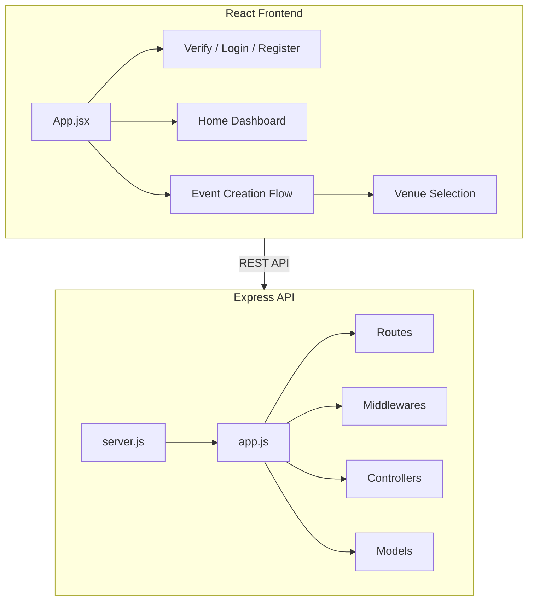
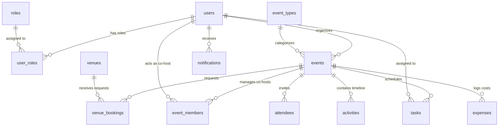

# Hoop Project Overview and Developer Guide

This document provides a summary of **Hoop**, an event planner guide application designed to streamline event planning for non-professional organizers.

---

## 🏗️ Architecture & Stack

The codebase is organized into a modular monorepo structure consisting of a backend API and a frontend application.

### 💻 Frontend
- **Framework:** React 18 (Vite-based build tool)
- **Styling:** CSS-in-JS design constants & custom styles matching a custom Design System.
- **Routing:** React Router DOM (v6)
- **Key Modules:**
  - **Verification/Auth:** LogIn, Register, and Account Verification under [verify/](file:///Users/leaphourleu/Storage/Y2SE/T3/T3%20Project%20/T3-Project/Frontend/HOOP-app/src/components/verify).
  - **Homepage/Dashboard:** Navbar, Hero section, and footer elements under [Homepage/](file:///Users/leaphourleu/Storage/Y2SE/T3/T3%20Project%20/T3-Project/Frontend/HOOP-app/src/components/Homepage).
  - **Event Creation Flow:** Curated event configuration workflow starting with [Venue Selection](file:///Users/leaphourleu/Storage/Y2SE/T3/T3%20Project%20/T3-Project/Frontend/HOOP-app/src/components/EventCreation/VenueSelection.jsx).

### ⚙️ Backend
- **Runtime:** Node.js
- **Framework:** Express.js
- **Key Files & Folders:**
  - [server.js](file:///Users/leaphourleu/Storage/Y2SE/T3/T3%20Project%20/T3-Project/BackEnd/src/server.js): Main server configuration and initialization.
  - [app.js](file:///Users/leaphourleu/Storage/Y2SE/T3/T3%20Project%20/T3-Project/BackEnd/src/app.js): Application middleware configuration and endpoint setup.
  - Directories structured for MVC patterns: controllers, models, routes, databases, middlewares, services, utils, and validation.

#### Planned Route Structure (Modular)
To maintain separation of concerns, the backend API routes should be split into domain-specific files:
- **Auth (`/api/auth`):** `auth.routes.js` (Login, Register, Verify)
- **Events (`/api/events`):** `events.routes.js` (Event creation, fetching, and updating)
- **Venues (`/api/venues`):** `venues.routes.js` (Venue catalog and booking request logic)
- **Guests (`/api/guests`):** `guests.routes.js` (RSVP tracking and attendance)
- **Budget (`/api/budget`):** `budget.routes.js` (Expense tracker and budget analyzer)

---

## 🎨 Design System (Muted Green Theme)

The project adheres to a specific Apple-inspired/minimalist Muted Green Theme:

*   **Deep Teal-Green (`#1F4D3F`):** Primary action buttons, headers, and focus states.
*   **Muted Sage Green (`#5A7A6B`):** Body/Secondary text, inactive states, and highlights.
*   **Soft Mint Green (`#8FA893`):** Tertiary accents and subtle section backgrounds.
*   **Light Cream (`#F5F5F0`):** App base background and card backdrops.

See the [DESIGN_CHECKLIST.md](file:///Users/leaphourleu/Storage/Y2SE/T3/T3%20Project%20/T3-Project/Frontend/HOOP-app/src/components/EventCreation/DESIGN_CHECKLIST.md) and [IMPLEMENTATION.md](file:///Users/leaphourleu/Storage/Y2SE/T3/T3%20Project%20/T3-Project/Frontend/HOOP-app/src/components/EventCreation/IMPLEMENTATION.md) for step-by-step UI design details.

---

## 🚶‍♂️ Page Navigation Flow

1.  **Authentication & Verification:**
    *   `Register` Page (Account details creation)
    *   `Verify` Page (Code verification / Password creation)
    *   `Login` Page (Access existing accounts)
2.  **Home Dashboard (`/home`):**
    *   Event overview cards and stats.
    *   "Create Event" call-to-action button.
3.  **Event Creation Flow:**
    *   Step 1: Set Up Event (Name, type, description)
    *   Step 2: Venue Selection (`/event-creation/venue`)
    *   Step 3: Time and Task schedule timeline page
4.  **Event Overview & Logistics:**
    *   Rsvp statistics visualization (Attending, Not Attending, Unverified).
    *   Guest attendance table & tracker.
    *   Budget Analyzer and expense tracker.

---

## 🗄️ Database Models Schema (PostgreSQL)

This section details the database models, relations, columns, and constraints parsed from the Prisma schema file located in [schema.prisma](file:///Users/leaphourleu/Storage/Y2SE/T3/T3%20Project%20/T3-Project/BackEnd/src/prisma/schema.prisma).

### 🗺️ Entity-Relationship Overview
The database uses a PostgreSQL server with the following mapping:

### 🗂️ Table Schema Specifications

#### 1. `users` Table
Stores registered organizer and helper accounts.

| Column | Data Type | Key / Constraint | Default Value | Description |
| :--- | :--- | :--- | :--- | :--- |
| `userId` | `Int` | Primary Key (Autoincrement) | | Unique internal user ID |
| `username` | `VarChar(100)` | | | User's display name |
| `email` | `VarChar(150)` | Unique | | Account email address |
| `passwordHash` | `VarChar(255)` | | | Hashed account password |
| `createdAt` | `DateTime` | | `now()` | Registration timestamp |

---

#### 2. `roles` Table
Lookup table defining application user roles.

| Column | Data Type | Key / Constraint | Default Value | Description |
| :--- | :--- | :--- | :--- | :--- |
| `roleId` | `Int` | Primary Key (Autoincrement) | | Unique role ID |
| `roleName` | `VarChar(50)` | | | Name of role (e.g. admin, organizer) |

---

#### 3. `user_roles` Table
Join table establishing many-to-many relationship between Users and Roles.

| Column | Data Type | Key / Constraint | Default Value | Description |
| :--- | :--- | :--- | :--- | :--- |
| `id` | `Int` | Primary Key (Autoincrement) | | |
| `userId` | `Int` | Foreign Key (User) | | Mapped to `User.userId` |
| `roleId` | `Int` | Foreign Key (Role) | | Mapped to `Role.roleId` |

*   **Unique Constraint:** `[userId, roleId]` (prevents assigning the same role to a user twice).

---

#### 4. `event_types` Table
Lookup table for organizing event types (e.g. Birthday, Wedding, Gathering).

| Column | Data Type | Key / Constraint | Default Value | Description |
| :--- | :--- | :--- | :--- | :--- |
| `eventTypeId` | `Int` | Primary Key (Autoincrement) | | Unique type ID |
| `typeName` | `VarChar(100)` | | | Name of event category |

---

#### 5. `events` Table
Stores individual events created by organizers.

| Column | Data Type | Key / Constraint | Default Value | Description |
| :--- | :--- | :--- | :--- | :--- |
| `eventId` | `Int` | Primary Key (Autoincrement) | | Unique event ID |
| `userId` | `Int` | Foreign Key (User) | | Organizer owner (`User.userId`) |
| `eventTitle` | `VarChar(200)` | | | Title of the event |
| `eventTypeId` | `Int` | Foreign Key (EventType) | | Category ID (`EventType.eventTypeId`) |
| `eventDate` | `DateTime` | `@db.Date` | | Calendar date of the event |
| `eventTime` | `DateTime` | `@db.Time` | | Start time of the event |
| `budget` | `Decimal(10,2)` | | | Total financial budget allocation |
| `createdAt` | `DateTime` | | `now()` | System creation log |

---

#### 6. `venues` Table
Stores details of venues available for events.

| Column | Data Type | Key / Constraint | Default Value | Description |
| :--- | :--- | :--- | :--- | :--- |
| `venueId` | `Int` | Primary Key (Autoincrement) | | Unique venue identifier |
| `name` | `VarChar(150)` | | | Name of the venue |
| `location` | `VarChar(255)` | | | Address details |
| `capacity` | `Int` | | | Max guest count limit |
| `contactEmail` | `VarChar(150)` | | | Venue contact email |
| `ownerId` | `Int?` | Foreign Key (User), Optional | | Mapped to `User.userId` |

---

#### 6b. `venue_bookings` Table
Tracks status of venue requests by event creators.

| Column | Data Type | Key / Constraint | Default Value | Description |
| :--- | :--- | :--- | :--- | :--- |
| `bookingId` | `Int` | Primary Key (Autoincrement) | | Unique booking request ID |
| `venueId` | `Int` | Foreign Key (Venue) | | Associated venue ID |
| `eventId` | `Int` | Foreign Key (Event), Unique | | Associated event ID |
| `status` | `BookingStatus` | Enum (BookingStatus) | `pending` | Current request status |
| `requestedAt` | `DateTime` | | `now()` | Creation timestamp |
| `respondedAt` | `DateTime?` | Optional | | Response timestamp |
| `notes` | `Text?` | Optional | | Feedback or details from venue |

*   **BookingStatus Enum Values:** `pending`, `approved`, `rejected`, `cancelled`.

---

#### 7. `attendees` Table
Stores the guest list and RSVP status responses.

| Column | Data Type | Key / Constraint | Default Value | Description |
| :--- | :--- | :--- | :--- | :--- |
| `attendeeId` | `Int` | Primary Key (Autoincrement) | | Unique attendee ID |
| `eventId` | `Int` | Foreign Key (Event) | | Associated event (`Event.eventId`) |
| `name` | `VarChar(150)` | | | Guest's display name |
| `email` | `VarChar(150)` | | | Guest's email address |
| `status` | `AttendeeStatus` | Enum (AttendeeStatus) | `pending` | RSVP status response |
| `responseTime` | `DateTime?` | Optional | | Timestamp of RSVP response |

*   **AttendeeStatus Enum Values:** `pending`, `accepted`, `declined`, `maybe`.

---

#### 8. `event_members` Table
Handles co-host assignments and event permissions.

| Column | Data Type | Key / Constraint | Default Value | Description |
| :--- | :--- | :--- | :--- | :--- |
| `id` | `Int` | Primary Key (Autoincrement) | | |
| `eventId` | `Int` | Foreign Key (Event) | | Mapped to `Event.eventId` |
| `userId` | `Int` | Foreign Key (User) | | Mapped to `User.userId` |
| `role` | `VarChar(50)` | | | Helper/Co-host role description |

*   **Unique Constraint:** `[eventId, userId]` (prevents duplicate membership entries).

---

#### 9. `tasks` Table
Schedules administrative action items and task assignees.

| Column | Data Type | Key / Constraint | Default Value | Description |
| :--- | :--- | :--- | :--- | :--- |
| `taskId` | `Int` | Primary Key (Autoincrement) | | Unique task ID |
| `eventId` | `Int` | Foreign Key (Event) | | Associated event (`Event.eventId`) |
| `assignedTo` | `Int?` | Foreign Key (User), Optional | | Mapped to `User.userId` |
| `description` | `Text` | | | Task description text |
| `status` | `TaskStatus` | Enum (TaskStatus) | `pending` | Progress indicator state |
| `deadline` | `DateTime?` | Optional | | Task completion target date |

*   **TaskStatus Enum Values:** `pending`, `in_progress`, `done`.

---

#### 10. `activities` Table
Represents calendar schedules or custom event programs.

| Column | Data Type | Key / Constraint | Default Value | Description |
| :--- | :--- | :--- | :--- | :--- |
| `activityId` | `Int` | Primary Key (Autoincrement) | | Unique activity identifier |
| `eventId` | `Int` | Foreign Key (Event) | | Associated event (`Event.eventId`) |
| `title` | `VarChar(150)` | | | Activity name |
| `description` | `Text?` | Optional | | Detail comments |
| `startTime` | `DateTime` | | | Start time |
| `endTime` | `DateTime` | | | End time |

---

#### 11. `expenses` Table
Logs costs and financial details for Event Budgets.

| Column | Data Type | Key / Constraint | Default Value | Description |
| :--- | :--- | :--- | :--- | :--- |
| `expenseId` | `Int` | Primary Key (Autoincrement) | | Unique expense identifier |
| `eventId` | `Int` | Foreign Key (Event) | | Associated event (`Event.eventId`) |
| `name` | `VarChar(150)` | | | Item/Service description |
| `category` | `VarChar(100)` | | | Category grouping |
| `estimatedCost` | `Decimal(10,2)` | | | Projected cost estimate |
| `actualCost` | `Decimal(10,2)` | | | Realized cost amount |

---

#### 12. `notifications` Table
Stores real-time notices for organizers and helpers.

| Column | Data Type | Key / Constraint | Default Value | Description |
| :--- | :--- | :--- | :--- | :--- |
| `notificationId` | `Int` | Primary Key (Autoincrement) | | Unique notification ID |
| `userId` | `Int` | Foreign Key (User) | | Mapped to target `User.userId` |
| `message` | `Text` | | | Notification display message |
| `isRead` | `Boolean` | | `false` | Read tracking state |
| `createdAt` | `DateTime` | | `now()` | Log timestamp |

