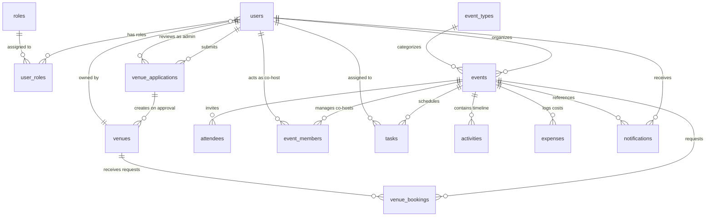
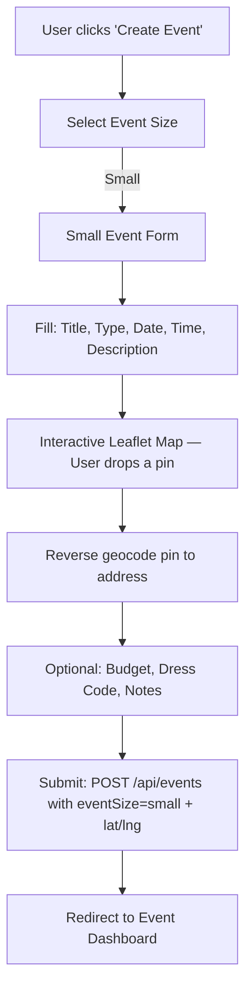
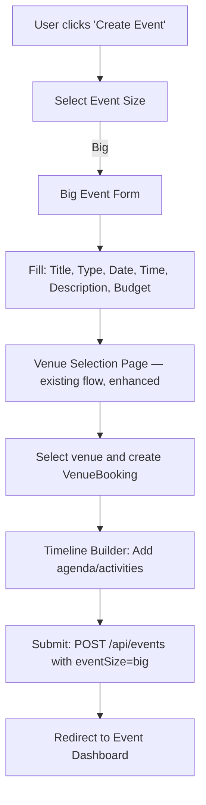
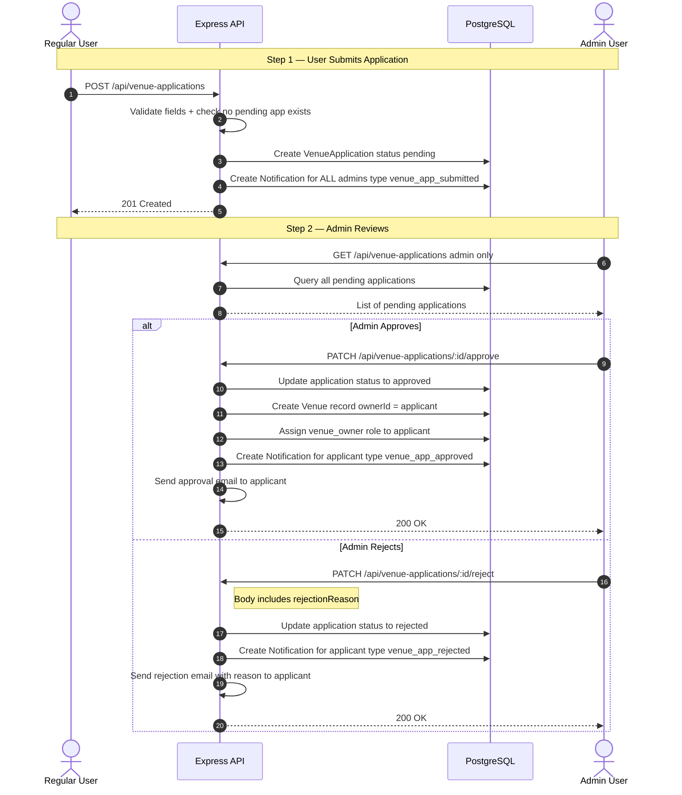
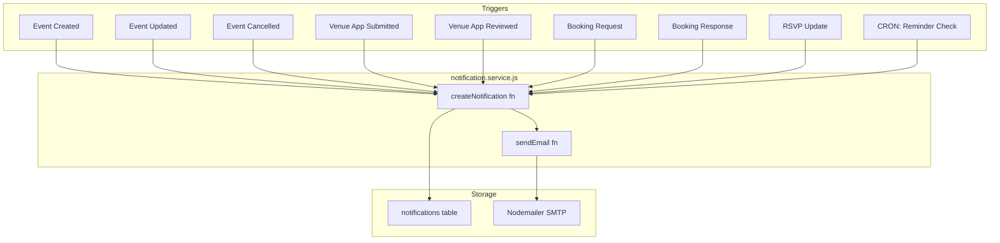
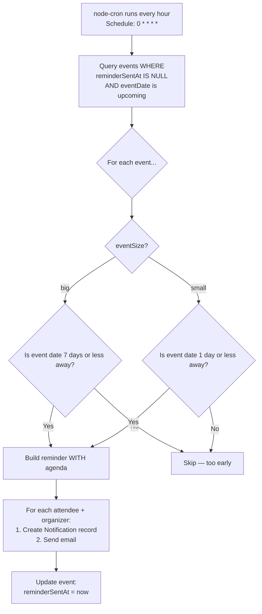

# 🔄 Hoop Project Redesign — Complete Specification

> **Document Version:** 2.0  
> **Last Updated:** 2026-06-26  
> **Status:** Approved for Implementation  
> **Reference:** Based on [projectUpdate.md](file:///Users/leaphourleu/Storage/Y2SE/T3/T3%20Project%20/T3-Project/projectUpdate.md) requirements

---

## Table of Contents

1. [Design Decisions (Finalized)](#-1-design-decisions-finalized)
2. [Role-Based Access Control System](#-2-role-based-access-control-system)
3. [Database Schema Redesign](#-3-database-schema-redesign)
4. [Small vs Big Event System](#-4-small-vs-big-event-system)
5. [Venue Application & Admin Approval Workflow](#-5-venue-application--admin-approval-workflow)
6. [Notification System & Email Integration](#-6-notification-system--email-integration)
7. [Automated Reminder System](#-7-automated-reminder-system)
8. [Map Integration (Leaflet + OpenStreetMap)](#-8-map-integration-leaflet--openstreetmap)
9. [Complete API Specification](#-9-complete-api-specification)
10. [Service Integrations](#-10-service-integrations)
11. [Existing Bug Inventory & Security Fixes](#-11-existing-bug-inventory--security-fixes)

---

## ✅ 1. Design Decisions (Finalized)

| # | Decision | Chosen Option | Reasoning |
|---|----------|---------------|-----------|
| 1 | Admin account creation | **Seed script** with hardcoded admin user | Simplest for a school/T3 project — no chicken-and-egg problem |
| 2 | Map provider | **Leaflet + OpenStreetMap** | Completely free, no API key or billing account required |
| 3 | Notification delivery | **In-app + Email** via Nodemailer | Full notification experience for attendees |
| 4 | Reminder timing | Big events: **7 days before** · Small events: **1 day before** | Single reminder per event |
| 5 | Event size mutability | **Locked after creation** | User must cancel and recreate if they need a different size |

---

## 🔐 2. Role-Based Access Control System

### 2.1 Role Definitions

The platform recognizes **three roles**. A user can hold multiple roles simultaneously (e.g., a user who is also a venue owner).

| Role | ID | Description | How It's Assigned |
|------|----|-------------|-------------------|
| `user` | 1 | Default role for all registered accounts. Can create events, invite guests, manage budgets. | **Automatically** on registration |
| `venue_owner` | 2 | Can manage their own venue listings and respond to booking requests. | **Automatically** when admin approves their venue application |
| `admin` | 3 | Can approve/reject venue applications, modify any venue, and manage platform-level settings. | **Seed script only** — the first admin is created via database seed |

### 2.2 Seed Script Data

```javascript
// prisma/seed.js

// Roles
const roles = [
  { roleId: 1, roleName: 'user' },
  { roleId: 2, roleName: 'venue_owner' },
  { roleId: 3, roleName: 'admin' },
];

// Event Types
const eventTypes = [
  { eventTypeId: 1, typeName: 'Birthday' },
  { eventTypeId: 2, typeName: 'Wedding' },
  { eventTypeId: 3, typeName: 'Corporate' },
  { eventTypeId: 4, typeName: 'Gathering' },
  { eventTypeId: 5, typeName: 'Party' },
  { eventTypeId: 6, typeName: 'Other' },
];

// Admin User (password should be changed after first login)
const adminUser = {
  username: 'admin',
  email: 'admin@hoop.local',
  passwordHash: '<bcrypt hash of a default password>',
};
// After creating the admin user, assign roleId: 3 in user_roles
```

### 2.3 Role Middleware Implementation

```javascript
// middlewares/roleMiddleware.js

/**
 * Creates a middleware that restricts access to users with specific roles.
 * @param  {...string} allowedRoles - Role names that are permitted (e.g., 'admin', 'venue_owner')
 * @returns {Function} Express middleware
 *
 * Usage in routes:
 *   router.get('/admin/venues', authorizeRoles('admin'), getAdminVenues);
 *   router.post('/venues', authorizeRoles('venue_owner', 'admin'), createVenue);
 */
export function authorizeRoles(...allowedRoles) {
  return async (req, res, next) => {
    try {
      // req.user is set by authMiddleware (JWT decoded payload)
      const userId = req.user.userId;

      // Query the user's roles from the database
      const userRoles = await prisma.userRole.findMany({
        where: { userId },
        include: { role: true },
      });

      const roleNames = userRoles.map(ur => ur.role.roleName);

      // Check if the user has at least one of the allowed roles
      const hasPermission = allowedRoles.some(role => roleNames.includes(role));

      if (!hasPermission) {
        return res.status(403).json({
          message: 'Forbidden: You do not have the required role to access this resource',
          requiredRoles: allowedRoles,
          yourRoles: roleNames,
        });
      }

      // Attach roles to request for downstream use
      req.userRoles = roleNames;
      next();
    } catch (err) {
      return res.status(500).json({ message: 'Internal server error during role check' });
    }
  };
}
```

### 2.4 Role System — Edge Cases & Handling

| # | Edge Case | Expected Behavior | HTTP Response |
|---|-----------|-------------------|---------------|
| 1 | User has **no roles** in `user_roles` table (data integrity issue) | Deny access to all protected routes | `403 Forbidden` with message "No roles assigned to your account" |
| 2 | User has **both** `user` and `venue_owner` roles | Allow access to both user and venue owner endpoints | `200 OK` — roles are additive, not exclusive |
| 3 | Deleted user's JWT token is still valid (hasn't expired) | Auth middleware passes, but role check queries DB for current state | If user doesn't exist anymore, role query returns empty → `403` |
| 4 | Admin tries to **remove their own admin role** | Prevent this — at least one admin must always exist | `400 Bad Request` with message "Cannot remove the last admin role" |
| 5 | Same role assigned **twice** to same user | Blocked by `@@unique([userId, roleId])` constraint in schema | Prisma throws unique constraint error → catch and return `409 Conflict` |

---

## 🗄️ 3. Database Schema Redesign

### 3.1 Complete Entity-Relationship Diagram (Updated)



### 3.2 New Enum Types

#### `EventSize`
```prisma
enum EventSize {
  small   // House party, dinner, study group — user pins location on map
  big     // Wedding, gala, conference — user selects from venue listings
}
```

#### `ApplicationStatus`
```prisma
enum ApplicationStatus {
  pending    // Submitted, waiting for admin review
  approved   // Admin approved — venue auto-created
  rejected   // Admin rejected — reason provided
}
```

#### `NotificationType`
```prisma
enum NotificationType {
  event_created        // "You've been invited to [Event Name]!"
  event_updated        // "Details for [Event Name] have been updated"
  event_cancelled      // "[Event Name] has been cancelled"
  event_reminder       // "Reminder: [Event Name] is in X days!"
  venue_app_submitted  // "Your venue application has been submitted"
  venue_app_approved   // "Your venue '[Name]' has been approved!"
  venue_app_rejected   // "Your venue application was not approved"
  booking_request      // "New booking request for your venue '[Name]'"
  booking_approved     // "Your venue booking has been confirmed!"
  booking_rejected     // "Your venue booking was declined"
  rsvp_update          // "X new RSVPs for your event"
}
```

### 3.3 New Table: `venue_applications`

Tracks venue listing requests from users to the admin.

| Column | Data Type | Key / Constraint | Default | Description |
|--------|-----------|------------------|---------|-------------|
| `applicationId` | `Int` | Primary Key (autoincrement) | | Unique application ID |
| `userId` | `Int` | Foreign Key → `users.userId` | | The user who submitted the application |
| `venueName` | `VarChar(150)` | | | Proposed venue name |
| `venueLocation` | `VarChar(255)` | | | Proposed venue address |
| `venueCapacity` | `Int` | | | Proposed max guest capacity |
| `contactEmail` | `VarChar(150)` | | | Contact email for the venue |
| `description` | `Text` | Optional | | Why the user wants to list this venue |
| `status` | `ApplicationStatus` | Enum | `pending` | Current review status |
| `reviewedBy` | `Int?` | Foreign Key → `users.userId`, Optional | | Admin who reviewed the application |
| `submittedAt` | `DateTime` | | `now()` | Submission timestamp |
| `reviewedAt` | `DateTime?` | Optional | | Review timestamp |
| `rejectionReason` | `Text?` | Optional | | Reason for rejection (required when rejecting) |

**Prisma Model:**
```prisma
model VenueApplication {
  applicationId   Int               @id @default(autoincrement())
  userId          Int
  venueName       String            @db.VarChar(150)
  venueLocation   String            @db.VarChar(255)
  venueCapacity   Int
  contactEmail    String            @db.VarChar(150)
  description     String?           @db.Text
  status          ApplicationStatus @default(pending)
  reviewedBy      Int?
  submittedAt     DateTime          @default(now())
  reviewedAt      DateTime?
  rejectionReason String?           @db.Text

  applicant User  @relation("VenueApplicant", fields: [userId], references: [userId])
  reviewer  User? @relation("VenueReviewer", fields: [reviewedBy], references: [userId])

  @@map("venue_applications")
}
```

### 3.4 Modified Table: `events`

New columns added to support small/big event split and reminder tracking.

| New Column | Data Type | Key / Constraint | Default | Description |
|------------|-----------|------------------|---------|-------------|
| `eventSize` | `EventSize` | Enum | — (required) | Whether this is a small or big event |
| `description` | `Text` | Optional | | Event description |
| `locationLat` | `Decimal(10,7)` | Optional | | Latitude for small event pin (null for big events) |
| `locationLng` | `Decimal(10,7)` | Optional | | Longitude for small event pin (null for big events) |
| `locationAddress` | `VarChar(500)` | Optional | | Human-readable address from reverse geocoding |
| `locationLabel` | `VarChar(200)` | Optional | | User's custom label, e.g., "My apartment" |
| `expectedGuests` | `Int` | Optional | | Rough headcount estimate |
| `dressCode` | `VarChar(50)` | Optional | | Casual / Semi-formal / Formal / Themed |
| `specialNotes` | `Text` | Optional | | e.g., "BYOB", "Parking behind the building" |
| `reminderSentAt` | `DateTime` | Optional | | Tracks when the automated reminder was sent (null = not sent yet) |

**Updated Prisma Model (additions only):**
```prisma
model Event {
  // ... existing fields ...
  eventSize       EventSize
  description     String?    @db.Text
  locationLat     Decimal?   @db.Decimal(10, 7)
  locationLng     Decimal?   @db.Decimal(10, 7)
  locationAddress String?    @db.VarChar(500)
  locationLabel   String?    @db.VarChar(200)
  expectedGuests  Int?
  dressCode       String?    @db.VarChar(50)
  specialNotes    String?    @db.Text
  reminderSentAt  DateTime?

  // ... existing relations ...
  notifications Notification[]
}
```

### 3.5 Modified Table: `venues`

New columns added for admin moderation and richer venue information.

| New Column | Data Type | Key / Constraint | Default | Description |
|------------|-----------|------------------|---------|-------------|
| `isActive` | `Boolean` | | `true` | Admin can deactivate without deleting (soft-delete) |
| `description` | `Text` | Optional | | Venue description |
| `imageUrls` | `String[]` | Optional | | Array of image URLs |
| `priceRange` | `VarChar(50)` | Optional | | e.g., "$", "$$", "$$$" |
| `amenities` | `String[]` | Optional | | e.g., ["WiFi", "Parking", "Sound System"] |

**Updated Prisma Model (additions only):**
```prisma
model Venue {
  // ... existing fields ...
  isActive    Boolean  @default(true)
  description String?  @db.Text
  imageUrls   String[] @default([])
  priceRange  String?  @db.VarChar(50)
  amenities   String[] @default([])

  // ... existing relations ...
}
```

### 3.6 Modified Table: `notifications`

Enhanced to support rich notifications with typed metadata.

| Modified/New Column | Data Type | Key / Constraint | Default | Description |
|---------------------|-----------|------------------|---------|-------------|
| `eventId` | `Int?` | Foreign Key → `events.eventId`, Optional | | Links notification to a specific event |
| `type` | `NotificationType` | Enum | — (required) | Categorizes the notification for rendering |
| `title` | `VarChar(200)` | | | Notification headline |
| `metadata` | `Json?` | Optional | | Structured payload (map URL, agenda, venue details, etc.) |

**Updated Prisma Model:**
```prisma
model Notification {
  notificationId Int              @id @default(autoincrement())
  userId         Int
  eventId        Int?
  type           NotificationType
  title          String           @db.VarChar(200)
  message        String           @db.Text
  metadata       Json?
  isRead         Boolean          @default(false)
  createdAt      DateTime         @default(now())

  user  User   @relation(fields: [userId], references: [userId])
  event Event? @relation(fields: [eventId], references: [eventId])

  @@map("notifications")
}
```

### 3.7 Modified Table: `users`

Add relations for venue applications (as applicant and as admin reviewer).

```prisma
model User {
  // ... existing fields and relations ...

  // New relations for venue applications
  venueApplications         VenueApplication[] @relation("VenueApplicant")
  reviewedVenueApplications VenueApplication[] @relation("VenueReviewer")
}
```

---

## 🎯 4. Small vs Big Event System

### 4.1 Event Size is Locked After Creation

Once an event is created as `small` or `big`, the `eventSize` field **cannot be changed**. If the organizer wants to switch from small to big (or vice versa), they must:

1. Cancel/delete the existing event
2. Create a new event with the desired size

### 4.2 Small Event — Creation Flow



**Small Event Form Fields:**

| Field | Input Type | Required | Validation |
|-------|-----------|----------|------------|
| Event Title | Text | ✅ | Min 3 chars, max 200 chars |
| Event Type | Dropdown (from `event_types`) | ✅ | Must be valid `eventTypeId` |
| Description | Textarea | Optional | Max 1000 chars |
| Event Date | Date Picker | ✅ | Must be today or in the future |
| Start Time | Time Picker | ✅ | — |
| End Time | Time Picker | ✅ | Must be after start time |
| Location (Map Pin) | Leaflet Map | ✅ | Must have valid lat/lng coordinates |
| Location Label | Text | Optional | e.g., "My apartment", max 200 chars |
| Expected Guests | Number | Optional | Min 1 if provided |
| Budget | Currency | Optional | Min 0 if provided |
| Dress Code | Dropdown | Optional | Casual / Semi-formal / Formal / Themed |
| Special Notes | Textarea | Optional | Max 500 chars |

### 4.3 Big Event — Creation Flow



### 4.4 Venue Card — Progressive Disclosure Design

**Card View (Partial Info — shown in the listing grid):**
```
┌─────────────────────────────────────┐
│  [Hero Image]                       │
│                                     │
│  Sunset Grand Hall            ⋯     │  ← Three-dot menu button
│  📍 Phnom Penh, Street 2004        │
│  👥 Capacity: 500                   │
│  💲 $$$                             │
│                                     │
│  ● Available                        │
└─────────────────────────────────────┘
```

**Expanded Panel (Full Details — opens on ⋯ click):**
```
┌─────────────────────────────────────────────┐
│  ← Back                                     │
│                                              │
│  Sunset Grand Hall                           │
│  ─────────────────────────────────────────   │
│  📍 Full Address:                            │
│     Street 2004, Sangkat BKK1,               │
│     Khan Chamkarmon, Phnom Penh               │
│                                              │
│  📧 Contact: events@sunsethall.com           │
│  👥 Max Capacity: 500                        │
│  💲 Price Range: $$$                         │
│                                              │
│  📝 Description:                             │
│  A premier event space featuring modern...   │
│                                              │
│  🏷️ Amenities:                               │
│  [WiFi] [Parking] [Sound System] [Catering]  │
│                                              │
│  📸 Photos:                                  │
│  [Image Carousel]                            │
│                                              │
│  🗺️ Map:                                    │
│  [Embedded Leaflet Map showing location]     │
│                                              │
│  [ Select This Venue ]                       │
└─────────────────────────────────────────────┘
```

### 4.5 Small vs Big Event — Edge Cases

| # | Edge Case | Behavior | HTTP Response |
|---|-----------|----------|---------------|
| 1 | Small event created **without** `locationLat` or `locationLng` | Reject creation | `400`: "Small events require a pinned location (latitude and longitude)" |
| 2 | Small event provides `locationLat` but **not** `locationLng` | Reject creation | `400`: "Both latitude and longitude are required" |
| 3 | Small event with lat/lng **outside valid range** (lat: -90 to 90, lng: -180 to 180) | Reject creation | `400`: "Invalid coordinates" |
| 4 | Big event created **without** selecting a venue | Allow — venue can be booked later | `201 Created` (venue booking is a separate step) |
| 5 | Big event's chosen venue has **capacity < expectedGuests** | Allow creation, but return a **warning** in the response | `201 Created` with `warnings: ["Venue capacity (200) may be insufficient for your expected guest count (350)"]` |
| 6 | User attempts to **change eventSize** via PUT `/api/events/:id` | Reject the change | `400`: "Event size cannot be changed after creation. Please cancel this event and create a new one." |
| 7 | Event date is **in the past** | Reject creation | `400`: "Event date must be today or in the future" |
| 8 | Event end time is **before or equal to** start time | Reject creation | `400`: "End time must be after start time" |
| 9 | Budget is a **negative number** | Reject | `400`: "Budget must be a positive number" |
| 10 | Expected guests is **0 or negative** | Reject if provided | `400`: "Expected guests must be at least 1" |
| 11 | User creates a small event but also submits a `venueId` | Ignore the venueId — small events don't have venues | `201 Created` (venueId is silently discarded) |
| 12 | Duplicate event title for the same user | Allow — users might have multiple "Birthday Party" events | `201 Created` |

---

## 🏢 5. Venue Application & Admin Approval Workflow

### 5.1 Complete Flow Diagram



### 5.2 Controller Functions

#### `venue-application.controller.js`

| Function | Route | Description |
|----------|-------|-------------|
| `submitApplication` | `POST /api/venue-applications` | User submits a new venue application |
| `getMyApplications` | `GET /api/venue-applications/mine` | User views their own application history + status |
| `getAllPendingApplications` | `GET /api/venue-applications` | Admin views all pending applications |
| `approveApplication` | `PATCH /api/venue-applications/:id/approve` | Admin approves → auto-creates venue + assigns role |
| `rejectApplication` | `PATCH /api/venue-applications/:id/reject` | Admin rejects → requires rejectionReason |

### 5.3 `submitApplication` — Detailed Logic

```
INPUT: { venueName, venueLocation, venueCapacity, contactEmail, description? }

VALIDATION:
  1. venueName: required, 3-150 chars
  2. venueLocation: required, 5-255 chars
  3. venueCapacity: required, positive integer, min 1
  4. contactEmail: required, valid email format
  5. description: optional, max 1000 chars

BUSINESS RULES:
  1. Check if user already has a PENDING application
     → 409 "You already have a pending venue application"
  2. Check if a venue with the exact same name already exists
     → 409 "A venue with this name already exists"

ACTIONS:
  1. Create VenueApplication record (status: pending)
  2. Find all users with admin role
  3. Create a Notification for each admin:
     - type: venue_app_submitted
     - title: "New Venue Application"
     - message: "[username] has submitted a venue application for '[venueName]'"
  4. Send email to admin(s) notifying of new application

RESPONSE: 201 { message: "Application submitted successfully", applicationId }
```

### 5.4 `approveApplication` — Detailed Logic

```
INPUT: URL param :id (applicationId)
AUTHORIZATION: Admin role required

BUSINESS RULES:
  1. Find application by ID → 404 if not found
  2. Check status is 'pending' → 409 "This application has already been reviewed"
  3. Wrap the following in a database TRANSACTION:
     a. Update application: status → 'approved', reviewedBy → admin userId, reviewedAt → now()
     b. Create Venue record from application data (ownerId = applicant userId, isActive = true)
     c. Check if applicant already has 'venue_owner' role → if not, create UserRole entry
     d. Create Notification for applicant:
        - type: venue_app_approved
        - title: "Venue Application Approved!"
        - message: "Your venue '[venueName]' has been approved and is now listed on the platform."
        - metadata: { venueId, venueName }
     e. Send approval email to applicant

RESPONSE: 200 { message: "Application approved", venueId }
```

### 5.5 `rejectApplication` — Detailed Logic

```
INPUT: URL param :id (applicationId), body: { rejectionReason }
AUTHORIZATION: Admin role required

VALIDATION:
  1. rejectionReason: required, min 10 chars (force meaningful feedback)

BUSINESS RULES:
  1. Find application by ID → 404 if not found
  2. Check status is 'pending' → 409 "This application has already been reviewed"
  3. Update application: status → 'rejected', reviewedBy, reviewedAt, rejectionReason
  4. Create Notification for applicant:
     - type: venue_app_rejected
     - title: "Venue Application Not Approved"
     - message: "Your venue application for '[venueName]' was not approved. Reason: [rejectionReason]"
  5. Send rejection email to applicant with reason

RESPONSE: 200 { message: "Application rejected" }
```

### 5.6 Venue Application — Edge Cases

| # | Edge Case | Behavior | HTTP Response |
|---|-----------|----------|---------------|
| 1 | User submits application while **already having a pending one** | Reject | `409`: "You already have a pending venue application. Please wait for review." |
| 2 | User submits application with the **same venue name** as an existing approved venue | Reject | `409`: "A venue with this name already exists on the platform" |
| 3 | Admin approves an application that was **already approved** (race condition) | Second request fails | `409`: "This application has already been reviewed" |
| 4 | Admin approves but the **applicant account was deleted** between submission and review | Transaction fails, rollback | `400`: "The applicant's account no longer exists" |
| 5 | Admin rejects **without providing a reason** | Reject the rejection | `400`: "A rejection reason is required (minimum 10 characters)" |
| 6 | User who is **already a venue_owner** submits another application | Allow — a user can own multiple venues | `201 Created` (but still check for pending apps) |
| 7 | Application ID in URL **doesn't exist** | Return not found | `404`: "Venue application not found" |
| 8 | Non-admin user tries to access admin endpoints | Role middleware blocks | `403`: "Forbidden: You do not have the required role" |
| 9 | Venue capacity is submitted as **a decimal** (e.g., 50.5) | Truncate to integer or reject | `400`: "Venue capacity must be a whole number" |
| 10 | Contact email format is **invalid** | Validation middleware catches | `400`: "Invalid email format" |

### 5.7 Admin Venue Management

Once a venue exists, both the **venue owner** and the **admin** can modify it, but with different scopes:

| Action | Venue Owner | Admin |
|--------|-------------|-------|
| View own venues | ✅ `GET /api/venues/mine` | ✅ `GET /api/admin/venues` (all venues) |
| Edit venue details | ✅ Only their own venues | ✅ Any venue |
| Deactivate/Activate venue | ❌ | ✅ `PATCH /api/admin/venues/:id/toggle-active` |
| Delete venue | ✅ Only their own (if no active bookings) | ✅ Any venue |

---

## 🔔 6. Notification System & Email Integration

### 6.1 Notification Architecture



### 6.2 Notification Service

```javascript
// services/notification.service.js

/**
 * Creates an in-app notification AND sends an email.
 *
 * @param {Object} params
 * @param {number} params.userId        - Recipient user ID
 * @param {number} [params.eventId]     - Related event ID (optional)
 * @param {string} params.type          - NotificationType enum value
 * @param {string} params.title         - Notification headline
 * @param {string} params.message       - Full message body
 * @param {Object} [params.metadata]    - Structured JSON payload
 * @param {string} [params.recipientEmail] - Email address for email delivery
 */
export async function createNotification({
  userId,
  eventId = null,
  type,
  title,
  message,
  metadata = null,
  recipientEmail = null,
}) {
  // 1. Save to database
  const notification = await prisma.notification.create({
    data: { userId, eventId, type, title, message, metadata },
  });

  // 2. Send email (fire-and-forget — don't block the response)
  if (recipientEmail) {
    sendEmail({
      to: recipientEmail,
      subject: title,
      html: buildEmailHtml({ title, message, metadata, type }),
    }).catch(err => console.error('Email send failed:', err));
  }

  return notification;
}
```

### 6.3 Email Integration — Nodemailer Setup

```javascript
// services/email.service.js
import nodemailer from 'nodemailer';

const transporter = nodemailer.createTransport({
  service: 'gmail',
  auth: {
    user: process.env.EMAIL_USER,      // e.g., hoop.events@gmail.com
    pass: process.env.EMAIL_APP_PASS,  // Gmail App Password (NOT regular password)
  },
});

/**
 * Sends an email using the configured transporter.
 * @param {Object} options
 * @param {string} options.to      - Recipient email
 * @param {string} options.subject - Email subject line
 * @param {string} options.html    - HTML body content
 */
export async function sendEmail({ to, subject, html }) {
  await transporter.sendMail({
    from: `"Hoop Events" <${process.env.EMAIL_USER}>`,
    to,
    subject,
    html,
  });
}
```

**Required `.env` variables:**
```
EMAIL_USER=hoop.events@gmail.com
EMAIL_APP_PASS=xxxx xxxx xxxx xxxx
```

> **Note:** Gmail requires an "App Password" (not your regular password). Generate one at: Google Account → Security → 2-Step Verification → App Passwords.

### 6.4 Notification Metadata Examples

#### Event Created Notification (Big Event)
```json
{
  "eventSize": "big",
  "eventDate": "2026-07-15",
  "eventTime": "18:00",
  "venueName": "Sunset Grand Hall",
  "locationAddress": "Street 2004, Sangkat BKK1, Phnom Penh",
  "mapUrl": "https://www.openstreetmap.org/?mlat=11.556&mlon=104.928#map=17/11.556/104.928"
}
```

#### Event Created Notification (Small Event)
```json
{
  "eventSize": "small",
  "eventDate": "2026-07-10",
  "eventTime": "19:00",
  "locationLabel": "Jake's apartment",
  "locationAddress": "Near Toul Tom Poung Market, Phnom Penh",
  "locationLat": 11.5494,
  "locationLng": 104.9194,
  "mapUrl": "https://www.openstreetmap.org/?mlat=11.5494&mlon=104.9194#map=17/11.5494/104.9194"
}
```

> **Important:** Event creation notifications do **NOT** include the agenda. Agendas are only included in **reminder** notifications.

#### Event Reminder Notification (Big Event — 7 days before)
```json
{
  "eventSize": "big",
  "eventDate": "2026-07-15",
  "eventTime": "18:00",
  "venueName": "Sunset Grand Hall",
  "locationAddress": "Street 2004, Sangkat BKK1, Phnom Penh",
  "mapUrl": "https://www.openstreetmap.org/?mlat=11.556&mlon=104.928#map=17/11.556/104.928",
  "agenda": [
    { "title": "Guest Arrival & Registration", "startTime": "18:00", "endTime": "18:30" },
    { "title": "Wedding Ceremony", "startTime": "18:30", "endTime": "19:00" },
    { "title": "Dinner Service", "startTime": "19:00", "endTime": "20:00" },
    { "title": "First Dance & Toasts", "startTime": "20:00", "endTime": "20:30" },
    { "title": "Live Music & Dancing", "startTime": "20:30", "endTime": "23:00" }
  ]
}
```

#### Event Reminder Notification (Small Event — 1 day before)
```json
{
  "eventSize": "small",
  "eventDate": "2026-07-10",
  "eventTime": "19:00",
  "locationLabel": "Jake's apartment",
  "locationAddress": "Near Toul Tom Poung Market, Phnom Penh",
  "locationLat": 11.5494,
  "locationLng": 104.9194,
  "mapUrl": "https://www.openstreetmap.org/?mlat=11.5494&mlon=104.9194#map=17/11.5494/104.9194",
  "dressCode": "Casual",
  "specialNotes": "Bring your own snacks! Parking available behind building.",
  "agenda": [
    { "title": "Pizza & Board Games", "startTime": "19:00", "endTime": "22:00" }
  ]
}
```

### 6.5 Notification — Edge Cases

| # | Edge Case | Behavior | Handling |
|---|-----------|----------|----------|
| 1 | Email delivery **fails** (SMTP down, invalid email) | Log the error, do NOT fail the entire request | Email is fire-and-forget; in-app notification still saved |
| 2 | User marks notification as read that **belongs to another user** | Reject | `403`: controller verifies `notification.userId === req.user.userId` |
| 3 | Notification references an event that was **deleted** | Notification persists (historical record) | "View Event" link in frontend is disabled/greyed out |
| 4 | User has **1000+ notifications** | Implement pagination | `GET /api/notifications?page=1&limit=20`, default limit=20, max limit=50 |
| 5 | Duplicate notifications — same event, same type, same user | Prevent exact duplicates within 1-minute window | Check `createdAt > now() - 1min` with same `userId + eventId + type` before inserting |
| 6 | Attendee has no email (email field is empty) | Skip email delivery, only create in-app notification | In-app notification only |
| 7 | Admin has **multiple** accounts — all should receive venue application notifications | Query ALL users with admin role and create notification for each | Loop through admin users |
| 8 | Gmail **rate limit** hit (500 emails/day for free Gmail) | Log warning, queue remaining emails | For T3 project scope, this is acceptable. Production would use SendGrid/Mailgun |
| 9 | `metadata` JSON is **malformed** when read from DB | Frontend JSON.parse with try/catch | Render notification without metadata fields; show basic message only |
| 10 | User deletes a notification | Hard delete | No audit trail needed for notifications at this project scope |

---

## ⏰ 7. Automated Reminder System

### 7.1 How It Works



### 7.2 Implementation

```javascript
// services/reminder.service.js
import cron from 'node-cron';
import prisma from '../config/prisma.config.js';
import { createNotification } from './notification.service.js';

/**
 * Starts the automated reminder CRON job.
 * Runs every hour at minute 0.
 *
 * Big events: sends reminder when event is <= 7 days away
 * Small events: sends reminder when event is <= 1 day away
 */
export function startReminderScheduler() {
  cron.schedule('0 * * * *', async () => {
    console.log('[Reminder] Running scheduled reminder check...');

    try {
      const now = new Date();
      const sevenDaysFromNow = new Date(now.getTime() + 7 * 24 * 60 * 60 * 1000);
      const oneDayFromNow = new Date(now.getTime() + 1 * 24 * 60 * 60 * 1000);

      // Find events that need reminders
      const events = await prisma.event.findMany({
        where: {
          reminderSentAt: null,  // Hasn't been sent yet
          eventDate: { gte: now }, // Event hasn't passed
        },
        include: {
          attendees: true,
          activities: { orderBy: { startTime: 'asc' } },
          organizer: true,
          venueBookings: {
            include: { venue: true },
            where: { status: 'approved' },
          },
        },
      });

      for (const event of events) {
        const eventDate = new Date(event.eventDate);
        let shouldSend = false;

        if (event.eventSize === 'big' && eventDate <= sevenDaysFromNow) {
          shouldSend = true;
        } else if (event.eventSize === 'small' && eventDate <= oneDayFromNow) {
          shouldSend = true;
        }

        if (!shouldSend) continue;

        // Build agenda from activities
        const agenda = event.activities.map(a => ({
          title: a.title,
          startTime: a.startTime,
          endTime: a.endTime,
        }));

        // Build map URL
        let mapUrl, locationAddress, venueName;
        if (event.eventSize === 'big' && event.venueBookings[0]?.venue) {
          const venue = event.venueBookings[0].venue;
          venueName = venue.name;
          locationAddress = venue.location;
          mapUrl = `https://www.openstreetmap.org/search?query=${encodeURIComponent(venue.location)}`;
        } else if (event.eventSize === 'small' && event.locationLat && event.locationLng) {
          locationAddress = event.locationAddress || event.locationLabel || 'Pinned location';
          mapUrl = `https://www.openstreetmap.org/?mlat=${event.locationLat}&mlon=${event.locationLng}#map=17/${event.locationLat}/${event.locationLng}`;
        }

        // Determine days until event
        const daysUntil = Math.ceil((eventDate - now) / (1000 * 60 * 60 * 24));
        const timeLabel = daysUntil === 1 ? 'tomorrow' : `in ${daysUntil} days`;

        // Build notification metadata
        const metadata = {
          eventSize: event.eventSize,
          eventDate: event.eventDate,
          eventTime: event.eventTime,
          venueName,
          locationAddress,
          locationLabel: event.locationLabel,
          locationLat: event.locationLat ? parseFloat(event.locationLat) : null,
          locationLng: event.locationLng ? parseFloat(event.locationLng) : null,
          mapUrl,
          dressCode: event.dressCode,
          specialNotes: event.specialNotes,
          agenda,
        };

        // Send to all attendees + organizer
        const recipients = [
          { userId: event.userId, email: event.organizer.email },
          ...event.attendees
            .filter(a => a.email)
            .map(a => ({ email: a.email })),
        ];

        for (const recipient of recipients) {
          await createNotification({
            userId: recipient.userId || event.userId,
            eventId: event.eventId,
            type: 'event_reminder',
            title: `Reminder: ${event.eventTitle} is ${timeLabel}!`,
            message: `Don't forget — ${event.eventTitle} is coming up on ${eventDate.toLocaleDateString()}.`,
            metadata,
            recipientEmail: recipient.email,
          });
        }

        // Mark reminder as sent
        await prisma.event.update({
          where: { eventId: event.eventId },
          data: { reminderSentAt: new Date() },
        });

        console.log(`[Reminder] Sent reminders for event: ${event.eventTitle} (ID: ${event.eventId})`);
      }
    } catch (err) {
      console.error('[Reminder] Scheduler error:', err);
    }
  });

  console.log('[Reminder] Scheduler started — runs every hour at :00');
}
```

### 7.3 Starting the Scheduler

Add to `server.js`:
```javascript
import { startReminderScheduler } from './services/reminder.service.js';

// Start server
app.listen(PORT, () => {
  console.log(`Server running on port ${PORT}`);
  startReminderScheduler(); // Start the CRON job
});
```

### 7.4 Reminder — Edge Cases

| # | Edge Case | Behavior |
|---|-----------|----------|
| 1 | Event has **no activities** (empty agenda) | Send reminder without agenda section — `agenda: []` |
| 2 | Big event has **no approved venue booking** | Send reminder without venue info — show "Venue TBD" |
| 3 | Small event has **no lat/lng** (data issue) | Send reminder without map URL |
| 4 | Event was **deleted** between CRON ticks | `findMany` won't return it — safely skipped |
| 5 | CRON job **crashes** mid-execution | Since `reminderSentAt` is only set AFTER sending, it will retry next hour |
| 6 | CRON job runs but server **restarts** at :00 | `node-cron` re-registers on startup; missed tick runs next hour |
| 7 | Two server instances running (horizontal scaling) | Both send duplicates — for T3 scope this is acceptable. Production: use a distributed lock (Redis) |
| 8 | Event date is **today** | Big event: already past 7-day window → still sends. Small event: within 1-day window → sends |
| 9 | Attendee list changes **after reminder was sent** | New attendees don't get the reminder (it was already sent). Acceptable for scope |

---

## 🗺️ 8. Map Integration (Leaflet + OpenStreetMap)

### 8.1 Why Leaflet + OpenStreetMap?

| Feature | Google Maps | Leaflet + OSM |
|---------|-------------|---------------|
| Cost | $200/month free credit, then pay-per-use | **Completely free** |
| API Key required | Yes (Google Cloud account) | **No** |
| Interactive map | ✅ | ✅ |
| Draggable pin | ✅ | ✅ |
| Reverse geocoding | ✅ (paid) | ✅ (Nominatim API — free) |
| Map link generation | ✅ | ✅ (OpenStreetMap URLs) |
| Quality | Higher detail in some areas | Excellent, community-maintained |

### 8.2 npm Packages Needed

```bash
npm install leaflet react-leaflet
```

### 8.3 Frontend Usage — Small Event Map Component

```jsx
// components/EventCreation/LocationPicker.jsx
import { MapContainer, TileLayer, Marker, useMapEvents } from 'react-leaflet';
import 'leaflet/dist/leaflet.css';
import { useState } from 'react';

function LocationPicker({ onLocationSelect }) {
  function DraggableMarker() {
    const [position, setPosition] = useState(null);

    useMapEvents({
      click(e) {
        setPosition(e.latlng);
        // Reverse geocode using Nominatim (free, no API key)
        fetch(
          `https://nominatim.openstreetmap.org/reverse?lat=${e.latlng.lat}&lon=${e.latlng.lng}&format=json`,
          { headers: { 'User-Agent': 'HoopEventPlanner/1.0' } }
        )
          .then(res => res.json())
          .then(data => {
            onLocationSelect({
              lat: e.latlng.lat,
              lng: e.latlng.lng,
              address: data.display_name,
            });
          });
      },
    });

    return position ? <Marker position={position} draggable /> : null;
  }

  return (
    <MapContainer
      center={[11.5564, 104.9282]}
      zoom={13}
      style={{ height: '400px', width: '100%', borderRadius: '12px' }}
    >
      <TileLayer
        url="https://{s}.tile.openstreetmap.org/{z}/{x}/{y}.png"
        attribution='&copy; OpenStreetMap contributors'
      />
      <DraggableMarker />
    </MapContainer>
  );
}

export default LocationPicker;
```

### 8.4 Map URL Generation Utility

```javascript
// utils/map.utils.js

/**
 * Generates an OpenStreetMap link for a small event (coordinates-based).
 * @param {number} lat - Latitude
 * @param {number} lng - Longitude
 * @returns {string} OpenStreetMap URL
 */
export function getSmallEventMapUrl(lat, lng) {
  return `https://www.openstreetmap.org/?mlat=${lat}&mlon=${lng}#map=17/${lat}/${lng}`;
}

/**
 * Generates an OpenStreetMap search link for a big event (address-based).
 * @param {string} address - Venue address
 * @returns {string} OpenStreetMap search URL
 */
export function getBigEventMapUrl(address) {
  return `https://www.openstreetmap.org/search?query=${encodeURIComponent(address)}`;
}
```

### 8.5 Reverse Geocoding — Nominatim API

Nominatim is OpenStreetMap's free geocoding service. No API key required.

| Feature | Details |
|---------|---------|
| Endpoint | `https://nominatim.openstreetmap.org/reverse?lat={lat}&lon={lng}&format=json` |
| Rate limit | **1 request/second** (must respect this!) |
| Response | JSON with `display_name` (human-readable address) |
| Usage policy | Must include `User-Agent` header identifying your app |

### 8.6 Map — Edge Cases

| # | Edge Case | Behavior |
|---|-----------|----------|
| 1 | User drops pin in the **ocean** | Allow — the pin is valid coordinates. Reverse geocode may return "unknown" |
| 2 | Nominatim API is **down** | Frontend shows pin coordinates as fallback, address field shows "Unable to fetch address" |
| 3 | User's browser **blocks geolocation** | Map defaults to a fixed center point (Phnom Penh: 11.5564, 104.9282) |
| 4 | User tries to zoom into an area with **no OSM data** | Map tiles may be sparse — this is an OSM limitation, acceptable |
| 5 | Coordinates have **excessive precision** (15+ decimal places) | Truncate to 7 decimal places (approximately 1cm accuracy, more than enough) |
| 6 | User **doesn't click** the map (no pin dropped) | Disable form submission until a pin is placed; show validation message |

---

## 📡 9. Complete API Specification

### 9.1 Auth Routes (`/api/auth`)

| Method | Route | Auth | Role | Controller | Status |
|--------|-------|------|------|------------|--------|
| `POST` | `/register` | ❌ | Any | `register` | ✅ Exists — needs update to auto-assign `user` role |
| `POST` | `/login` | ❌ | Any | `login` | ✅ Exists — needs to include user roles in response |
| `POST` | `/refresh` | ❌ | Any | `refresh` | ✅ Exists |
| `GET` | `/profile` | ✅ | Any | inline | ✅ Exists — needs to include roles |

#### Updated `register` Function Logic:
```
CHANGES NEEDED:
  1. After creating User record, also create UserRole entry:
     - userId: newUser.userId
     - roleId: 1 (user)
  2. Return the assigned role in the response
```

#### Updated `login` Function Logic:
```
CHANGES NEEDED:
  1. After verifying password, query UserRoles for this user (include Role names)
  2. Include roles in the JWT payload:
     generateAccessToken({ userId, email, roles: ['user', 'venue_owner'] })
  3. Include roles in the response body
```

#### Auth Edge Cases:
| # | Case | Handling |
|---|------|----------|
| 1 | Register with an email that **already exists** | `409`: "User already exists" (already handled) |
| 2 | Login with **incorrect password** | `401`: "Invalid credentials" (already handled) |
| 3 | Login with **email that doesn't exist** | `404`: "User not found" (already handled) |
| 4 | Refresh token **expired** | `403`: "Invalid or expired refresh token" (already handled) |
| 5 | Register with **empty password** | `400`: Validation middleware should catch |
| 6 | Register with **password shorter than 8 chars** | `400`: Add minimum length validation |
| 7 | Login while **already logged in** (valid cookies exist) | Allow — issue new tokens (idempotent) |

---

### 9.2 Event Routes (`/api/events`)

| Method | Route | Auth | Role | Controller | Status |
|--------|-------|------|------|------------|--------|
| `POST` | `/` | ✅ | `user` | `createEvent` | ⚠️ Needs major update |
| `GET` | `/` | ✅ | `user` | `getEvents` | ⚠️ Has bug (variable name mismatch) |
| `GET` | `/:id` | ✅ | `user` | `getEventById` | ⚠️ Needs to include relations |
| `PUT` | `/:id` | ✅ | `user` | `updateEvent` | ⚠️ Needs ownership check + eventSize lock |
| `DELETE` | `/:id` | ✅ | `user` | `deleteEvent` | ⚠️ Needs ownership check + cascade |

#### Updated `createEvent` — Full Logic:

```
INPUT:
  Common fields: { eventTitle, eventTypeId, eventDate, eventTime, eventEndTime,
                    budget, eventSize, description? }
  Small event adds: { locationLat, locationLng, locationAddress?, locationLabel?,
                       expectedGuests?, dressCode?, specialNotes? }
  Big event adds:   { expectedGuests?, dressCode?, specialNotes? }

VALIDATION:
  1. eventTitle: required, 3-200 chars
  2. eventTypeId: required, must exist in event_types table
  3. eventDate: required, must be today or in the future
  4. eventTime: required
  5. eventEndTime: required, must be after eventTime
  6. budget: optional, non-negative decimal
  7. eventSize: required, must be 'small' or 'big'
  8. IF eventSize === 'small':
     a. locationLat: required, -90 to 90
     b. locationLng: required, -180 to 180
  9. expectedGuests: optional, must be >= 1 if provided
  10. dressCode: optional, one of: Casual, Semi-formal, Formal, Themed

BUSINESS RULES:
  1. userId comes from req.user.userId (JWT)
  2. If eventSize is 'small' and a venueId is in the body, silently ignore it
  3. Create Event record in database

RESPONSE: 201 { message: "Event created", event: { ...eventData } }
```

#### Updated `getEventById` — Full Logic:

```
CHANGES:
  1. Include relations in the query:
     include: {
       eventType: true,
       activities: { orderBy: { startTime: 'asc' } },
       attendees: true,
       venueBookings: { include: { venue: true } },
       expenses: true,
       tasks: true,
       eventMembers: { include: { user: true } },
     }
  2. Add ownership check: event.userId === req.user.userId
     OR user is a member (eventMembers)
```

#### Updated `updateEvent` — Full Logic:

```
VALIDATION:
  1. All same validations as createEvent (for fields that are provided)
  2. REJECT if body contains 'eventSize' that differs from existing event.eventSize
     → 400: "Event size cannot be changed after creation"

BUSINESS RULES:
  1. Verify ownership: event.userId === req.user.userId → 403 if not
  2. Only update fields that are provided in the body (partial update)
  3. If updating eventDate to the past → 400
```

#### Updated `deleteEvent` — Full Logic:

```
BUSINESS RULES:
  1. Verify ownership: event.userId === req.user.userId → 403 if not
  2. Cascade delete related records (use Prisma onDelete cascade or manual):
     - Delete all Activities for this event
     - Delete all Attendees for this event
     - Delete all Tasks for this event
     - Delete all Expenses for this event
     - Delete all EventMembers for this event
     - Delete all VenueBookings for this event
     - Delete all Notifications referencing this event
     - Finally delete the Event itself
  3. If event has an approved VenueBooking, send notification to venue owner
     that the booking is cancelled

RESPONSE: 204 No Content
```

#### Event Route Edge Cases:
| # | Case | Handling |
|---|------|----------|
| 1 | Create event with **eventTypeId that doesn't exist** | `400`: "Invalid event type" |
| 2 | Update event that **doesn't belong to you** | `403`: "You can only modify your own events" |
| 3 | Delete event that **doesn't belong to you** | `403`: "You can only delete your own events" |
| 4 | Get event by ID that **doesn't exist** | `404`: "Event not found" |
| 5 | Create event with **eventDate = today, eventTime already passed** | Allow for today (time is hard to validate across timezones) |
| 6 | Create event with **budget = 0** | Allow — user may set budget later |
| 7 | Update event **after the event date has passed** | Allow — user might need to update expenses or notes retroactively |
| 8 | Delete event **after the event date has passed** | Allow — user is cleaning up |
| 9 | Create event with **very long title** (>200 chars) | `400`: validation catches this |
| 10 | Two events with the **same title, same date, same user** | Allow — not a unique constraint |

---

### 9.3 Activity Routes (`/api/events/:eventId/activities`)

| Method | Route | Auth | Role | Controller | Status |
|--------|-------|------|------|------------|--------|
| `POST` | `/` | ✅ | `user` (event owner) | `createActivity` | 🆕 New |
| `GET` | `/` | ✅ | `user` (event owner/member) | `getActivities` | 🆕 New |
| `PUT` | `/:activityId` | ✅ | `user` (event owner) | `updateActivity` | 🆕 New |
| `DELETE` | `/:activityId` | ✅ | `user` (event owner) | `deleteActivity` | 🆕 New |

#### `createActivity` — Full Logic:

```
INPUT: { title, description?, startTime, endTime }

VALIDATION:
  1. title: required, 3-150 chars
  2. startTime: required, valid datetime
  3. endTime: required, valid datetime, must be after startTime
  4. description: optional, max 1000 chars

BUSINESS RULES:
  1. Verify the event exists and belongs to req.user.userId → 404 / 403
  2. Validate that startTime and endTime fall within the event's date range
  3. If two activities overlap → allow but include a warning in response

RESPONSE: 201 { message: "Activity created", activity: { ... } }
```

#### Activity Edge Cases:
| # | Case | Handling |
|---|------|----------|
| 1 | Activity startTime is **outside event date** | `400`: "Activity must be on the event date" |
| 2 | Activity endTime is **before** startTime | `400`: "End time must be after start time" |
| 3 | Two activities with **identical** start/end times | Allow — parallel tracks are valid |
| 4 | Activity for an event that **doesn't exist** | `404`: "Event not found" |
| 5 | Activity for an event the user **doesn't own** | `403`: "You can only manage activities for your own events" |
| 6 | Delete an activity that **doesn't belong to the specified event** | `404`: "Activity not found for this event" |
| 7 | Create activity with **empty title** | `400`: validation catches |
| 8 | Update only the description, leaving times unchanged | Allow partial update |

---

### 9.4 Venue Routes (`/api/venues`)

| Method | Route | Auth | Role | Controller | Status |
|--------|-------|------|------|------------|--------|
| `GET` | `/` | ✅ | Any | `getVenues` | ⚠️ Needs update (only return active venues) |
| `GET` | `/:venueId` | ✅ | Any | `getVenuePartial` | ⚠️ Needs update (return partial info only) |
| `GET` | `/:venueId/details` | ✅ | Any | `getVenueDetails` | 🆕 New (full detail for expanded panel) |
| `GET` | `/mine` | ✅ | `venue_owner` | `getMyVenues` | 🆕 New |
| `PUT` | `/:venueId` | ✅ | `venue_owner` (own) / `admin` | `updateVenue` | ⚠️ Needs ownership/role guard |
| `DELETE` | `/:venueId` | ✅ | `venue_owner` (own) / `admin` | `deleteVenue` | ⚠️ Needs ownership/role guard |
| `GET` | `/booking/:eventId` | ✅ | `user` (event owner) | `getBookingByEvent` | ✅ Exists (minor fixes needed) |
| `POST` | `/:venueId/book` | ✅ | `user` | `createBooking` | 🆕 New |

#### `getVenues` (Updated) — Partial View for Listing:
```
CHANGES:
  1. Add filter: where: { isActive: true }
  2. Select only partial fields:
     venueId, name, location (city only), capacity, priceRange, imageUrls (first image only)
  3. Support query params: ?search=, ?minCapacity=, ?maxCapacity=, ?priceRange=
```

#### `getVenueDetails` — Full View:
```
SELECT: All fields including description, amenities, full imageUrls array, contactEmail, owner info
INCLUDE: Recent booking status counts (approved, pending)
```

#### Venue Edge Cases:
| # | Case | Handling |
|---|------|----------|
| 1 | Venue owner tries to **update a venue they don't own** | `403`: "You can only modify your own venues" |
| 2 | Venue owner tries to **delete a venue with active bookings** | `400`: "Cannot delete venue with active bookings" |
| 3 | Admin deactivates a venue that has **pending bookings** | Auto-reject all pending bookings with reason "Venue deactivated by admin" |
| 4 | `GET /api/venues` with **no active venues** | `200`: return empty array `[]` (not 204) |
| 5 | Search query matches **no venues** | `200`: return empty array |
| 6 | Venue ID in URL **doesn't exist** | `404`: "Venue not found" |
| 7 | Deactivated venue accessed via **direct URL** | Return venue with `isActive: false`; frontend shows "Currently unavailable" |

---

### 9.5 Venue Application Routes (`/api/venue-applications`)

| Method | Route | Auth | Role | Controller | Status |
|--------|-------|------|------|------------|--------|
| `POST` | `/` | ✅ | `user` | `submitApplication` | 🆕 |
| `GET` | `/mine` | ✅ | `user` | `getMyApplications` | 🆕 |
| `GET` | `/` | ✅ | `admin` | `getAllPendingApplications` | 🆕 |
| `PATCH` | `/:id/approve` | ✅ | `admin` | `approveApplication` | 🆕 |
| `PATCH` | `/:id/reject` | ✅ | `admin` | `rejectApplication` | 🆕 |

*(Detailed logic and edge cases covered in Section 5)*

---

### 9.6 Admin Routes (`/api/admin/venues`)

| Method | Route | Auth | Role | Controller | Status |
|--------|-------|------|------|------------|--------|
| `GET` | `/` | ✅ | `admin` | `getAdminVenues` | 🆕 |
| `PATCH` | `/:id` | ✅ | `admin` | `adminUpdateVenue` | 🆕 |
| `PATCH` | `/:id/toggle-active` | ✅ | `admin` | `toggleVenueActive` | 🆕 |

#### `getAdminVenues` Logic:
```
Returns ALL venues (active and inactive) with additional info:
  - Owner details (username, email)
  - Booking counts
  - Application reference
  - isActive status

Supports: ?status=active|inactive|all (default: all)
```

#### `adminUpdateVenue` Logic:
```
Admin can update ANY field of ANY venue:
  - name, location, capacity, contactEmail, description, imageUrls, priceRange, amenities
  - Cannot change ownerId (ownership transfer is not supported)
```

#### `toggleVenueActive` Logic:
```
Toggles isActive between true and false.
If deactivating:
  1. Set isActive = false
  2. Find all pending VenueBookings for this venue
  3. Auto-reject them with notes: "Venue deactivated by administrator"
  4. Notify the organizers of each rejected booking
  5. Notify the venue owner that their venue has been deactivated
```

---

### 9.7 Notification Routes (`/api/notifications`)

| Method | Route | Auth | Role | Controller | Status |
|--------|-------|------|------|------------|--------|
| `GET` | `/` | ✅ | Any | `getNotifications` | 🆕 |
| `GET` | `/unread-count` | ✅ | Any | `getUnreadCount` | 🆕 |
| `PATCH` | `/:id/read` | ✅ | Any | `markAsRead` | 🆕 |
| `PATCH` | `/read-all` | ✅ | Any | `markAllAsRead` | 🆕 |
| `DELETE` | `/:id` | ✅ | Any | `deleteNotification` | 🆕 |

#### `getNotifications` Logic:
```
INPUT: query params ?page=1&limit=20&type=event_reminder (optional filter by type)

RETURNS: Paginated notifications for req.user.userId, ordered by createdAt DESC
{
  notifications: [ ... ],
  pagination: { page: 1, limit: 20, total: 87, totalPages: 5 }
}
```

---

### 9.8 Guest/Attendee Routes (`/api/guests`) — Updates Needed

| Method | Route | Auth | Role | Controller | Status |
|--------|-------|------|------|------------|--------|
| `GET` | `/` | ✅ | `user` | `getGuests` | ⚠️ Has bugs |
| `POST` | `/` | ✅ | `user` | `addGuest` | ⚠️ Has bugs (no response, no eventId) |
| `GET` | `/:attendeeId` | ✅ | `user` | `getGuestById` | ⚠️ Minor fixes |
| `PUT` | `/:attendeeId` | ✅ | `user` | `updateGuestInfo` | ✅ Mostly correct |
| `DELETE` | `/:attendeeId` | ✅ | `user` | `deleteGuest` | ✅ Works |

#### Updated `addGuest` — Full Logic:
```
INPUT: { eventId, name, email }

VALIDATION:
  1. eventId: required, must exist and belong to req.user.userId
  2. name: required, 1-150 chars
  3. email: required, valid email format

BUSINESS RULES:
  1. Check if attendee with same email already exists for this event → 409
  2. Create Attendee record (status: pending)
  3. Create notification for the attendee (type: event_created) with event details + map link
  4. Send invitation email to the attendee

RESPONSE: 201 { message: "Guest added", attendee: { ... } }
```

#### Guest Edge Cases:
| # | Case | Handling |
|---|------|----------|
| 1 | Add guest with **same email** to same event | `409`: "This email is already on the guest list" |
| 2 | Add guest to event **you don't own** | `403`: "You can only manage guests for your own events" |
| 3 | Update guest RSVP status to **invalid value** | `400`: "Status must be one of: pending, accepted, declined, maybe" |
| 4 | Delete guest from event **you don't own** | `403` |
| 5 | Get guests but **no guests exist** for the event | `200`: return empty array `[]` |
| 6 | Guest email is **not a registered user** | Allow — guests don't need accounts. They receive email notifications only |
| 7 | Add guest after event has already **passed** | Allow — organizer might be retroactively tracking attendance |

---

### 9.9 Budget/Expense Routes (`/api/budget`) — Currently Stubbed

| Method | Route | Auth | Role | Controller | Status |
|--------|-------|------|------|------------|--------|
| `GET` | `/?eventId=` | ✅ | `user` | `getExpenses` | ⚠️ Stub (501) |
| `POST` | `/` | ✅ | `user` | `addExpense` | ⚠️ Stub (501) |
| `GET` | `/:expenseId` | ✅ | `user` | `getExpenseById` | ⚠️ Stub (501) |
| `PUT` | `/:expenseId` | ✅ | `user` | `updateExpense` | ⚠️ Stub (501) |
| `DELETE` | `/:expenseId` | ✅ | `user` | `deleteExpense` | ⚠️ Stub (501) |

#### Budget Edge Cases:
| # | Case | Handling |
|---|------|----------|
| 1 | Estimated cost is **negative** | `400`: "Cost must be a positive number" |
| 2 | Actual cost **exceeds** estimated cost | Allow — return a warning that expense went over budget |
| 3 | Total expenses **exceed** event budget | Allow — return a warning with the overage amount |
| 4 | Add expense to event **you don't own** | `403` |
| 5 | Category name is **empty** | `400`: "Category is required" |
| 6 | Delete expense from event that's **already past** | Allow — retroactive bookkeeping |

---

## 🔌 10. Service Integrations

### 10.1 Required Services (Must Have)

| Service | npm Package | Purpose | Cost |
|---------|-------------|---------|------|
| **Leaflet** | `leaflet`, `react-leaflet` | Interactive maps for small event location pin | Free |
| **OpenStreetMap Tiles** | Built into Leaflet | Map tile rendering | Free |
| **Nominatim** | HTTP API (no package needed) | Reverse geocoding (lat/lng to address) | Free (rate limited: 1 req/sec) |
| **Nodemailer** | `nodemailer` | Sending notification/reminder emails | Free (Gmail SMTP) |
| **node-cron** | `node-cron` | Scheduling automated reminder checks | Free |
| **bcrypt** | `bcrypt` | Password hashing | Free (already installed) |
| **jsonwebtoken** | `jsonwebtoken` | JWT token generation/validation | Free (already installed) |

### 10.2 Recommended Services (Nice to Have)

| Service | npm Package | Purpose | Cost |
|---------|-------------|---------|------|
| **Cloudinary** | `cloudinary` | Image upload for venue photos | Free tier (25 credits/month) |
| **Socket.io** | `socket.io` | Real-time notification bell updates | Free |
| **qrcode** | `qrcode` | QR code generation for event check-in | Free |
| **pdfkit** | `pdfkit` | Export event summary as PDF | Free |
| **Zod** | `zod` | Schema validation (supplementing Joi) | Free |

### 10.3 Environment Variables Update

Add to `.env`:
```env
# Email (Nodemailer)
EMAIL_USER=hoop.events@gmail.com
EMAIL_APP_PASS=xxxx xxxx xxxx xxxx

# Cloudinary (if implemented)
CLOUDINARY_CLOUD_NAME=your_cloud_name
CLOUDINARY_API_KEY=your_api_key
CLOUDINARY_API_SECRET=your_api_secret

# Nominatim (no key needed, but set User-Agent)
NOMINATIM_USER_AGENT=HoopEventPlanner/1.0
```

---

## 🐛 11. Existing Bug Inventory & Security Fixes

### 11.1 Bugs Found in Current Code

> These bugs exist **right now** and should be fixed regardless of the redesign.

| # | Severity | File | Line(s) | Bug Description | Fix |
|---|----------|------|---------|-----------------|-----|
| 1 | 🔴 Crash | `event.controller.js` | L33 | Variable named `error` but referenced as `err` in `getEvents` catch block | Rename `error` to `err` |
| 2 | 🔴 Data Corruption | `event.controller.js` | L11 | `toString(eventTitle)` — global `toString()` returns `[object Undefined]` | Change to `String(eventTitle)` or `eventTitle.toString()` |
| 3 | 🔴 Crash | `event.controller.js` | L112-118 | `createTimeLine` has syntax error: `const [ ]` — incomplete destructuring | Remove or complete the function |
| 4 | 🔴 Runtime Error | `event.controller.js` | L99 | `prisma.event.budget.findUnique` — `budget` is not a Prisma model accessor | Should query `prisma.expense.findMany({ where: { eventId } })` |
| 5 | 🔴 Data Corruption | `guest.Controller.js` | L27 | `toString(name)` — same global toString bug | Change to `String(name)` |
| 6 | 🔴 Client Hang | `guest.Controller.js` | L22-33 | `addGuest` never sends a response — client waits forever | Add `res.status(201).json(guest)` after create |
| 7 | 🔴 Prisma Error | `guest.Controller.js` | L25 | `addGuest` doesn't include `eventId` in the create data — required field | Add `eventId` from request body or params |
| 8 | 🟡 Semantics | `venue.controller.js` | L19 | Uses `res.status(201)` for GET responses — 201 means "Created" | Change to `res.status(200)` for GET responses |
| 9 | 🟡 Dead Code | `venues.routes.js` | L6 | Imports `updateEvent` from event controller — never used | Remove unused import |

### 11.2 Security Vulnerabilities

| # | Severity | Issue | Location | Fix |
|---|----------|-------|----------|-----|
| 1 | 🔴 Critical | No ownership check on `deleteEvent` — any user can delete ANY event by ID | `event.controller.js` L84-93 | Add `where: { eventId, userId: req.user.userId }` |
| 2 | 🔴 Critical | No ownership check on `updateEvent` — same issue | `event.controller.js` L70-81 | Add `userId: req.user.userId` to where clause |
| 3 | 🔴 Critical | No ownership check on `deleteVenue` — any user can delete any venue | `venue.controller.js` L153-164 | Verify `venue.ownerId === req.user.userId OR admin role` |
| 4 | 🟡 Medium | `roleMiddleware.js` is empty — no role-based access control at all | `roleMiddleware.js` | Implement `authorizeRoles` middleware (Section 2.3) |
| 5 | 🟡 Medium | Login cookies not set with `secure` or `sameSite` flags | `auth.controller.js` L60-61 | Add `{ httpOnly: true, secure: false, sameSite: 'lax', path: '/' }` |

---

## 📁 Updated Folder Structure

```
BackEnd/src/
├── config/
│   ├── jwt.js                              (existing)
│   └── prisma.config.js                    (existing)
├── controllers/
│   ├── auth.controller.js                  (MODIFY: add role assignment on register)
│   ├── event.controller.js                 (MODIFY: small/big split, bug fixes)
│   ├── guest.controller.js                 (MODIFY: bug fixes, notifications)
│   ├── venue.controller.js                 (MODIFY: partial/full views, ownership checks)
│   ├── venue-application.controller.js     (NEW)
│   ├── admin.controller.js                 (NEW)
│   ├── notification.controller.js          (NEW)
│   ├── activity.controller.js              (NEW)
│   └── budget.controller.js                (NEW — replace stubs)
├── middlewares/
│   ├── authMiddleware.js                   (existing)
│   ├── roleMiddleware.js                   (MODIFY: implement authorizeRoles)
│   ├── validate.middleware.js              (existing)
│   └── logger.Middleware.js                (existing)
├── routes/
│   ├── auth.routes.js                      (existing)
│   ├── events.routes.js                    (MODIFY: add activity sub-routes)
│   ├── venues.routes.js                    (MODIFY: add partial/detail routes)
│   ├── guests.routes.js                    (existing)
│   ├── budget.routes.js                    (MODIFY: replace stubs with controllers)
│   ├── venue-application.routes.js         (NEW)
│   ├── admin.routes.js                     (NEW)
│   └── notification.routes.js              (NEW)
├── services/
│   ├── notification.service.js             (NEW)
│   ├── email.service.js                    (NEW)
│   └── reminder.service.js                 (NEW)
├── prisma/
│   ├── schema.prisma                       (MODIFY: add new models/enums/fields)
│   └── seed.js                             (NEW: seed roles, event types, admin user)
├── utils/
│   ├── error.utils.js                      (existing)
│   ├── jwt.utils.js                        (existing)
│   ├── reqBody.utils.js                    (existing)
│   └── map.utils.js                        (NEW: map URL generation)
├── validation/
│   ├── auth.validation.js                  (existing)
│   ├── event.validation.js                 (MODIFY: add new fields)
│   ├── guest.validation.js                 (existing)
│   ├── venue.validation.js                 (MODIFY: add new fields)
│   ├── venue-application.validation.js     (NEW)
│   ├── activity.validation.js              (NEW)
│   └── notification.validation.js          (NEW)
├── app.js                                  (MODIFY: register new routes)
└── server.js                               (MODIFY: start reminder scheduler)
```

---

## Implementation Order

The recommended order of implementation is:

1. **Schema** → Update `schema.prisma` with new enums, models, and columns
2. **Seed** → Create `seed.js` with roles, event types, and admin user
3. **Middleware** → Implement `roleMiddleware.js`
4. **Services** → Build `notification.service.js`, `email.service.js`, `reminder.service.js`
5. **Bug Fixes** → Fix all 9 bugs in existing controllers
6. **Security** → Add ownership checks to existing controllers
7. **Controllers** → Build new controllers (venue-application, admin, notification, activity, budget)
8. **Routes** → Wire up new route files and register in `app.js`
9. **Frontend** → Build LocationPicker component, update event creation flow, add venue detail panel
10. **Testing** → Run Prisma validate, test all endpoints, verify reminder scheduler

---

*This document serves as the single source of truth for the Hoop v2 redesign. All schema changes, API specifications, edge cases, and service integrations are detailed above.*
