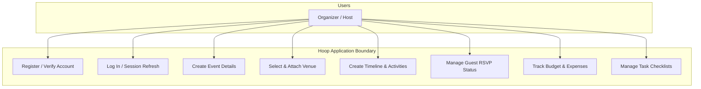
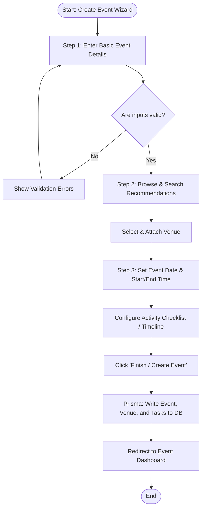
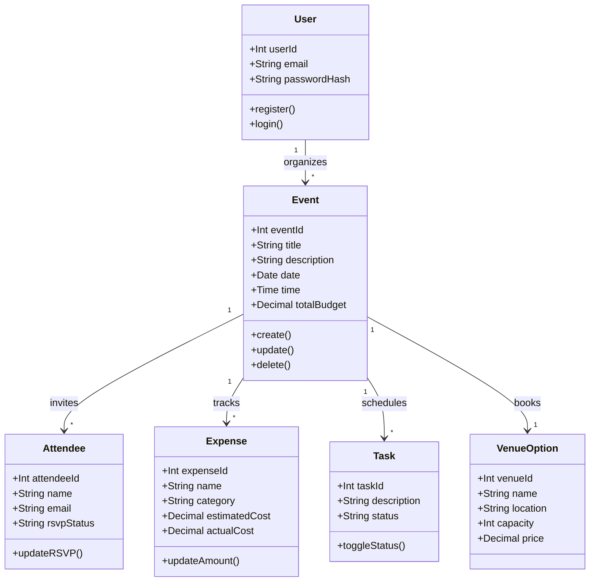
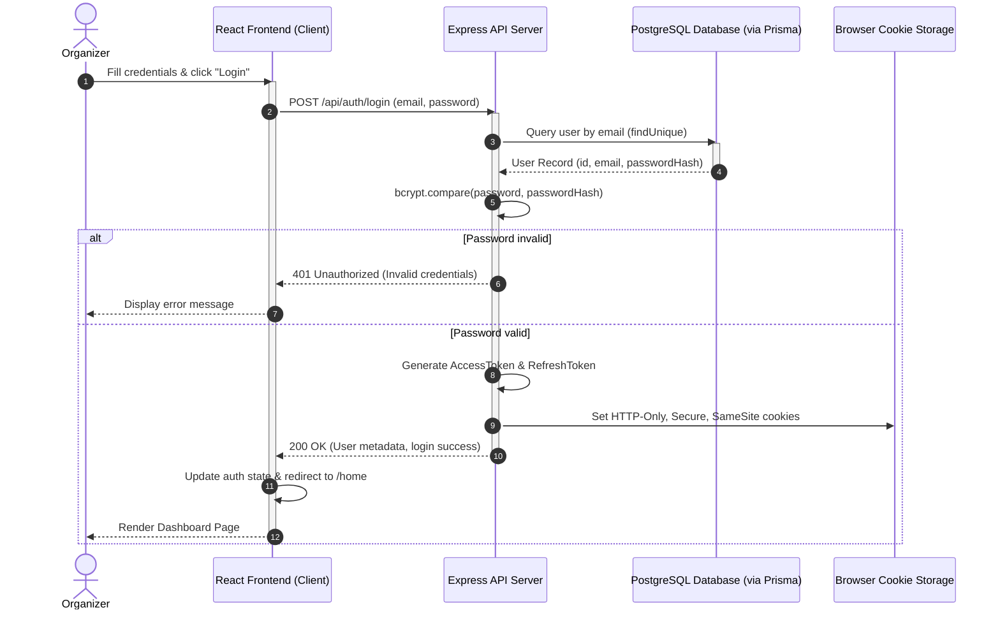

# 📋 HOOP Project Requirements & Development Specification

This document details the **Functional Requirements**, **Non-Functional Requirements**, **Development Methodology**, and **UML Diagram Specifications** for **Hoop**—an event planner guide application designed to streamline event planning for non-professional organizers.

---

## 🏗️ 1. Development Methodology: Agile (Scrum Framework)

To support the iterative development of the Hoop platform, an **Agile/Scrum** methodology is utilized. This allows the team to adapt quickly to user feedback, manage design-to-development transitions efficiently, and deliver increments of value.

### Key Agile/Scrum Components
*   **Roles:**
    *   **Product Owner:** Manages the product backlog, defines user stories, and prioritizes the event planning features (e.g., adding budget analytics).
    *   **Scrum Master:** Facilitates daily operations, ensures the team adheres to Agile principles, and removes development blockers (e.g., database connection leaks, CORS configurations).
    *   **Development Team:** Cross-functional members responsible for frontend React implementation, backend Express controllers, and database Prisma schemas.
*   **Sprints:** 2-week development cycles. Each sprint begins with a planning session to commit to backlog items and ends with a review and retrospective.
*   **Artifacts:**
    *   **Product Backlog:** A prioritized list of features, bug fixes, and technical debt (e.g., `README.md` and `BACKEND_ROADMAP.md`).
    *   **Sprint Backlog:** The subset of product backlog tasks selected for the current sprint.
    *   **Sprint Burndown Chart:** Tracks remaining work in the sprint to monitor velocity.
*   **Ceremonies:**
    *   **Sprint Planning:** Define the sprint goal and select backlog items.
    *   **Daily Standup (15 mins):** Sync on progress (what was done yesterday, what will be done today, and identify any blockers).
    *   **Sprint Review:** Demonstrate working software (e.g., demonstrating the completed Event Creation Flow) to stakeholders.
    *   **Sprint Retrospective:** Analyze team performance and establish continuous improvement measures.

---

## 🎯 2. Functional Requirements (FR)
Functional requirements define the core features and actions that users can perform within the Hoop application.

### FR-1: User Authentication & Onboarding
*   **FR-1.1:** Users must be able to register a new account using a unique email address and password.
*   **FR-1.2:** Registered users must verify their accounts using a verification code or secure email validation.
*   **FR-1.3:** Users must be able to log in securely to access their dashboard.
*   **FR-1.4:** The system must implement a JWT token lifecycle (short-lived AccessToken and long-lived RefreshToken) stored in secure HTTP-only cookies to handle sessions.

### FR-2: Home Dashboard
*   **FR-2.1:** The system must display a dashboard containing event cards representing upcoming and past events.
*   **FR-2.2:** The system must present quick stats summarizing the organizer's activities (e.g., total events, upcoming events, total guests).
*   **FR-2.3:** Users must be able to search and filter event list cards by date or event type.

### FR-3: Event Creation Wizard (3-Step Flow)
*   **FR-3.1 (Step 1: Set Up Event):** Users must be able to enter event basic details: event title, type (e.g., Birthday, Wedding, Gathering), description, and visibility (Public/Private).
*   **FR-3.2 (Step 2: Venue Selection):** The system must recommend a curated list of static venue options with filters for location, capacity, and price. Users can select and attach a venue to their event.
*   **FR-3.3 (Step 3: Time and Task Timeline):** Users must be able to schedule the event date, start/end times, and add individual timeline activities. The wizard must display a live vertical timeline preview.

### FR-4: Event Overview & Logistics Management
*   **FR-4.1 (Guest & RSVP Tracker):** Organizers must be able to manage a guest list by adding/inviting attendees. They can view RSVP statuses (Attending, Not Attending, Unverified) displayed alongside a visual pie/donut chart representing breakdown statistics.
*   **FR-4.2 (Budget Analyzer & Expense Tracker):** Organizers must be able to define a total budget, add and category-track individual expenses (Venue, Catering, Decorations, Activities, Misc), and view remaining budget balances on a visual spent vs. remaining progress bar.
*   **FR-4.3 (Task Checklist):** Organizers can add, assign, and track pre-event checklist items with progress states (`pending`, `in_progress`, `done`).

---

## ⚙️ 3. Non-Functional Requirements (NFR)
Non-functional requirements describe system qualities, operational constraints, and performance parameters.

### NFR-1: Usability & User Experience (UX)
*   **NFR-1.1 (Consistent Theme):** The application interface must strictly adhere to the Muted Green Design Theme:
    *   *Deep Teal-Green (`#1F4D3F`):* Headers, primary action CTAs, and active focus outlines.
    *   *Muted Sage Green (`#5A7A6B`):* Navigation elements, highlights, and secondary text.
    *   *Soft Mint Green (`#8FA893`):* Container borders, backgrounds, and minor accents.
    *   *Light Cream (`#F5F5F0`):* Card panels and base backdrop layout.
*   **NFR-1.2 (Responsive Design):** The UI must be optimized across three viewport breakpoints:
    *   *Mobile (<768px):* Single-column stacked layouts, bottom nav tabs, full-screen modals, and collapsible hamburger sidebar menus.
    *   *Tablet (768px - 1024px):* Split columns, card grids.
    *   *Desktop (>1024px):* Persistent left-hand sidebar navigation, multi-column dashboard widget displays.
*   **NFR-1.3 (Micro-Animations):** The frontend must include 150ms-300ms hover transitions for buttons and cards (e.g., slight elevation scales) to provide responsive feedback.

### NFR-2: Performance & Scalability
*   **NFR-2.1 (Response Time):** Main navigation page loads and page transitions must render in under 300ms using Vite + React bundling.
*   **NFR-2.2 (API Latency):** Backend REST API endpoints must respond in under 500ms under standard load conditions.
*   **NFR-2.3 (Prisma Singleton):** The backend must implement a single Prisma Client instance to prevent database connection pool exhaustion.

### NFR-3: Security & Data Integrity
*   **NFR-3.1 (Password Protection):** All passwords must be hashed using `bcrypt` (minimum of 10 salt rounds) before database storage.
*   **NFR-3.2 (Token Security):** Access and Refresh tokens must be stored in secure, HTTP-only, SameSite cookies to protect against Cross-Site Scripting (XSS) and Cross-Site Request Forgery (CSRF).
*   **NFR-3.3 (CORS Policy):** The backend API must explicitly whitelist only the React client origin (`http://localhost:5173`) and block all unauthorized cross-origin requests.
*   **NFR-3.4 (Input Validation):** All incoming API payloads must run through structured validation middleware (e.g., Joi or Zod) to filter malformed data.

### NFR-4: Accessibility (a11y)
*   **NFR-4.1 (Keyboard Navigation):** All interactive buttons, inputs, and form controls must be navigable using standard tab order.
*   **NFR-4.2 (Visual Contrast):** All text elements must maintain a minimum contrast ratio of 4.5:1 against their backgrounds.
*   **NFR-4.3 (Screen Reader Compatibility):** All icon-only buttons (such as delete icons) must contain descriptive `aria-label` tags.

---

## 📊 4. UML Diagrams Specification & Description

To satisfy Software Engineering verification, the architecture maps to 4 primary UML diagrams:

### A. Use Case Diagram
*   **Description:** Illustrates the boundaries of the Hoop application and the interactions between the **Organizer** (Primary Actor) and the system services.
*   **Mermaid Representation:**

---

### B. Activity Diagram (Event Creation Flow)
*   **Description:** Details the step-by-step workflow of the 3-step Event Creation Wizard, representing decision forks and parallel actions.
*   **Mermaid Representation:**

---

### C. Class Diagram
*   **Description:** Represents the object-oriented structure of the backend database entities and their relationships.
*   **Mermaid Representation:**

---

### D. Sequence Diagram (User Login & Token Generation)
*   **Description:** Visualizes the chronological exchange of messages between the React Frontend Client, the Express API Server, the Database, and cookie storage during standard user login.
*   **Mermaid Representation:**

